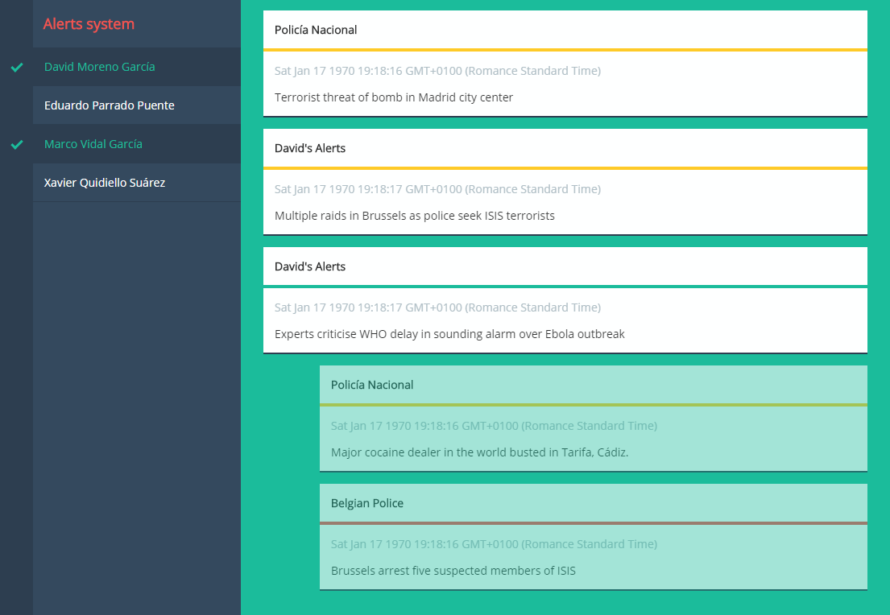

# server-sent-events
Server-sent-events is a simple project to show how to work with server-sent events HTML5 API. Several servers can be added to the nav bar menu and once enabled, the client will wait for messages with the next form:

``` json
{
  "source": "Server 1",
  "message": "Sample message",
  "alertLevel": "low|medium|high",
  "timestamp": 1448297970
}
```

With every message received, a new item will be added to the list.


